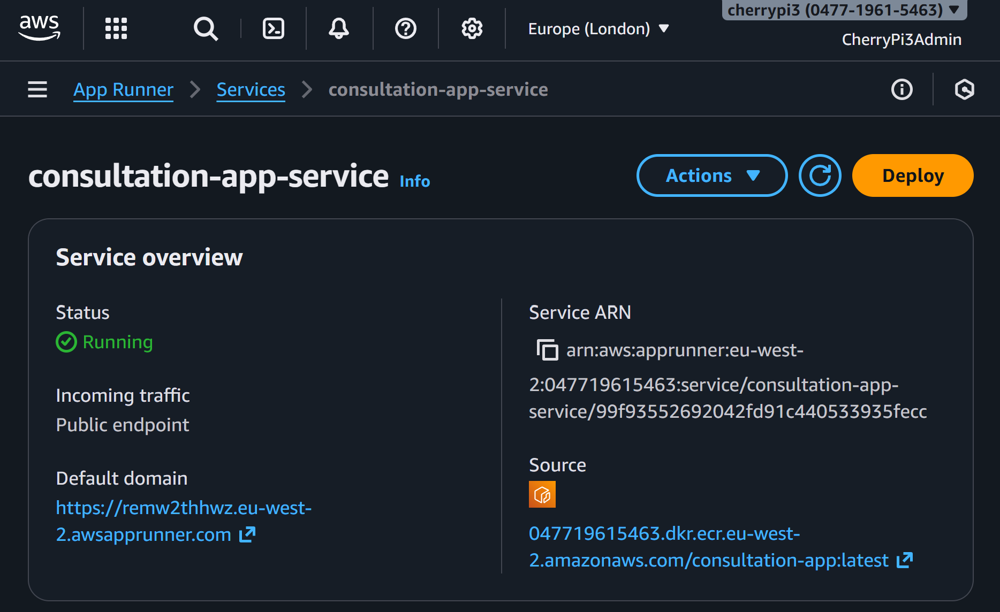

# 🚀 LLMOps – Healthcare App

### 🌐 Deploy to AWS App Runner Branch

This branch deploys the fully containerised **Healthcare Consultation App** into **AWS App Runner**, giving you a fully managed, auto-scaling, HTTPS-enabled production environment.

Once this stage is complete, you will have:

* An App Runner service pulling your Docker image from ECR
* Environment variables securely stored in App Runner
* Health checks and auto-scaling configured
* A live HTTPS endpoint running your healthcare app
* A simple workflow for redeploying updates by pushing new images to ECR

This is the final step that takes your application from local development to production deployment.

## 🧱 Step 1 – Launch App Runner

1. Open AWS Console → search for **App Runner**
2. Click **Create service**

## ⚙️ Step 2 – Configure Source

1. **Source**

   * Repository type: **Container registry**
   * Provider: **Amazon ECR**
2. Click **Browse**
3. Select your repository:

   * `consultation-app`
   * Tag: `latest`
4. **Deployment settings**

   * Deployment trigger: **Manual**
   * ECR access role: **Create new service role**
5. Click **Next**

## 🛠️ Step 3 – Configure Service

1. **Service name**
   `consultation-app-service`
2. **Compute settings**

   * vCPU: `0.25 vCPU`
   * Memory: `0.5 GB`
3. **Environment variables**
   Add the following:

   * `CLERK_SECRET_KEY`
   * `CLERK_JWKS_URL`
   * `OPENAI_API_KEY`
4. **Port**
   `8000`
5. **Auto scaling**

   * Minimum size: `1`
   * Maximum size: `1`
6. Click **Next**

## ❤️ Step 4 – Configure Health Check

1. Protocol: **HTTP**
2. Path: `/health`
3. Interval: `20` seconds
4. Timeout: `5` seconds
5. Healthy threshold: `2`
6. Unhealthy threshold: `5`
7. Click **Next**

## 🚀 Step 5 – Review & Deploy

1. Review your configuration
2. Click **Create & deploy**
3. Wait **5–10 minutes** until the service status becomes **Running**

## 🌍 Step 6 – Access Your Live Application

1. Click the automatically assigned **Default domain**
2. Your live application loads over HTTPS

<div align="center">
  
</div>

3. Test the full workflow:

   * Clerk authentication
   * Consultation summary
   * Streaming output
   * Sign out

Your healthcare app is now live on AWS App Runner.

# 🔄 Updating & Redeploying the Application

To push updates to AWS, simply rebuild your image, push to ECR, and trigger a new deployment.

## 🔧 Step 1 – Rebuild & Push Image

### Mac / Linux

```bash
docker build \
  --platform linux/amd64 \
  --build-arg NEXT_PUBLIC_CLERK_PUBLISHABLE_KEY="$NEXT_PUBLIC_CLERK_PUBLISHABLE_KEY" \
  -t consultation-app .

docker tag consultation-app:latest $AWS_ACCOUNT_ID.dkr.ecr.$DEFAULT_AWS_REGION.amazonaws.com/consultation-app:latest

docker push $AWS_ACCOUNT_ID.dkr.ecr.$DEFAULT_AWS_REGION.amazonaws.com/consultation-app:latest
```

### Windows PowerShell

```powershell
docker build `
  --platform linux/amd64 `
  --build-arg NEXT_PUBLIC_CLERK_PUBLISHABLE_KEY="$env:NEXT_PUBLIC_CLERK_PUBLISHABLE_KEY" `
  -t consultation-app .

docker tag consultation-app:latest "$env:AWS_ACCOUNT_ID.dkr.ecr.$env:DEFAULT_AWS_REGION.amazonaws.com/consultation-app:latest"

docker push "$env:AWS_ACCOUNT_ID.dkr.ecr.$env:DEFAULT_AWS_REGION.amazonaws.com/consultation-app:latest"
```

## 🚢 Step 2 – Redeploy in App Runner

1. Open **AWS App Runner**
2. Select `consultation-app-service`
3. Click **Deploy**
4. Wait for the update to complete