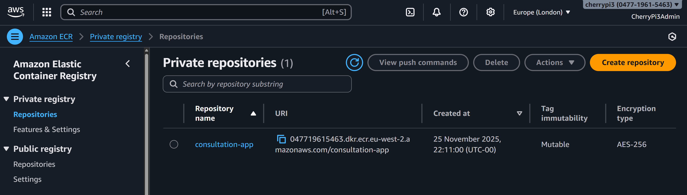
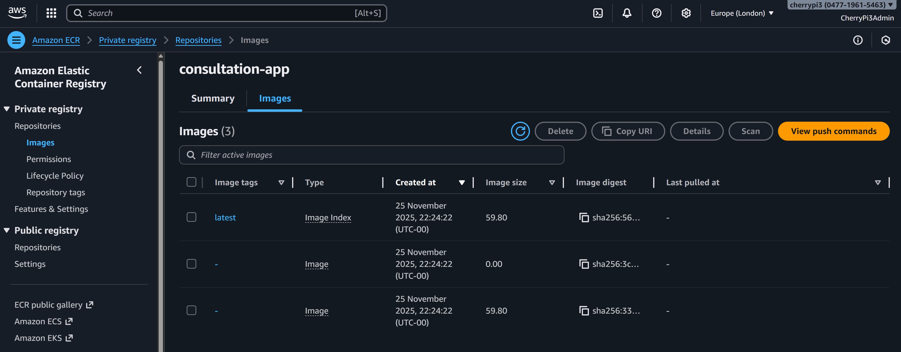

# 🚀 LLMOps – Healthcare App

### 🐳 Deploy to AWS ECR (Elastic Container Registry) Branch

This branch prepares your application for **deployment to AWS** by pushing your Docker container to **Amazon ECR**, the secure container registry used by AWS App Runner, ECS, and other AWS services.

Once this stage is complete, you will have:

* A private ECR repository named `consultation-app`
* AWS CLI configured locally with correct permissions
* Your Docker image tagged and pushed to ECR
* A verified image ready for deployment in the next branch (AWS App Runner)

## 🧩 Overview

Amazon ECR acts as the **official storage location** for your container image.
AWS App Runner will later pull this image directly from ECR to deploy your healthcare application into production.

To complete this stage, you will:

* Create the ECR repository
* Configure AWS CLI using a secure IAM user
* Authenticate Docker to ECR
* Build your container for AWS
* Push your tagged image to ECR

Everything here uses the environment variables already saved in your `.env`.


## 🧱 Step 1 – Create the ECR Repository

ECR (Elastic Container Registry) is where we will store our Docker image.

1. Open AWS Console → search for **ECR**
2. Click **Get started** or **Create repository**
3. Ensure you are in the **correct AWS region**
4. Configure the repository:

   * Visibility: **Private**
   * Repository name: `consultation-app`
     *(must match exactly, including hyphen!)*
   * Leave all other settings at default
5. Click **Create repository**
6. Confirm that your new repository appears in the list

<div align="center">
  
</div>


## 🔐 Step 2 – Set Up AWS CLI

To push your Docker image to ECR, we need to configure AWS CLI using **IAM access keys**.

### Create Access Keys

1. Open AWS Console → search **IAM**
2. Click **Users**
3. Select your user: `aiengineer`
4. Go to the **Security credentials** tab
5. Under **Access keys**, click **Create access key**
6. Choose:

   * **Command Line Interface (CLI)**
7. Tick the confirmation box → **Next**
8. Description: `Docker push access`
9. Click **Create access key**
10. *Copy or download both values*:

    * Access key ID
    * Secret access key

These keys will be used once during configuration.

### Configure AWS CLI

Install AWS CLI if needed:

* Mac: `brew install awscli`
* Windows: Download from [https://aws.amazon.com/cli/](https://aws.amazon.com/cli/)

Then configure:

```bash
aws configure
```

Enter:

* AWS Access Key ID
* AWS Secret Access Key
* Default region:
  Choose the same as in your `.env`
  (e.g. `eu-west-1`, `us-east-1`, etc.)
* Output format: `json`

Your AWS CLI is now linked to your IAM user.


## 📦 Step 3 – Push Your Docker Image to ECR

1. Return to ECR → open the `consultation-app` repository
2. Click **View push commands** for guidance
3. Use the commands below with your `.env` values already loaded

### Mac / Linux

```bash
# 1. Authenticate Docker to ECR
aws ecr get-login-password --region $DEFAULT_AWS_REGION | docker login --username AWS --password-stdin $AWS_ACCOUNT_ID.dkr.ecr.$DEFAULT_AWS_REGION.amazonaws.com

# 2. Build for Linux/AMD64 (IMPORTANT for Apple Silicon)
docker build \
  --platform linux/amd64 \
  --build-arg NEXT_PUBLIC_CLERK_PUBLISHABLE_KEY="$NEXT_PUBLIC_CLERK_PUBLISHABLE_KEY" \
  -t consultation-app .

# 3. Tag the image
docker tag consultation-app:latest $AWS_ACCOUNT_ID.dkr.ecr.$DEFAULT_AWS_REGION.amazonaws.com/consultation-app:latest

# 4. Push the image
docker push $AWS_ACCOUNT_ID.dkr.ecr.$DEFAULT_AWS_REGION.amazonaws.com/consultation-app:latest
```

### Windows PowerShell

```powershell
# 1. Authenticate Docker to ECR
aws ecr get-login-password --region $env:DEFAULT_AWS_REGION | docker login --username AWS --password-stdin "$env:AWS_ACCOUNT_ID.dkr.ecr.$env:DEFAULT_AWS_REGION.amazonaws.com"

# 2. Build for Linux/AMD64
docker build `
  --platform linux/amd64 `
  --build-arg NEXT_PUBLIC_CLERK_PUBLISHABLE_KEY="$env:NEXT_PUBLIC_CLERK_PUBLISHABLE_KEY" `
  -t consultation-app .

# 3. Tag the image
docker tag consultation-app:latest "$env:AWS_ACCOUNT_ID.dkr.ecr.$env:DEFAULT_AWS_REGION.amazonaws.com/consultation-app:latest"

# 4. Push the image
docker push "$env:AWS_ACCOUNT_ID.dkr.ecr.$env:DEFAULT_AWS_REGION.amazonaws.com/consultation-app:latest"
```

### ⏳ Push Time

The push usually takes **2–5 minutes** depending on connection speed.


## ✅ Checkpoint

After pushing, your ECR console should show your image:

<div align="center">
  
</div>

You should see:

* Repository: `consultation-app`
* Tag: `latest`
* Image size
* Pushed timestamp

This confirms your Docker image is now stored in AWS and ready for deployment via App Runner in the next stage.